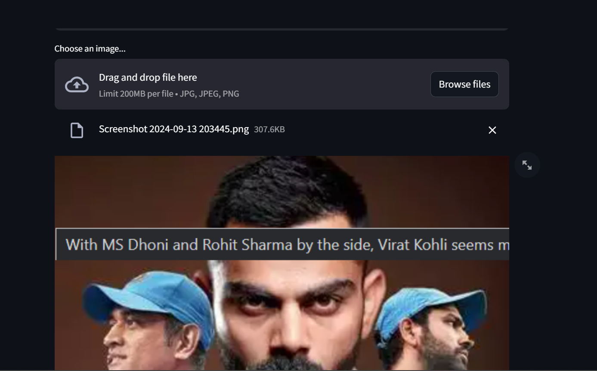

# Gemini Image Demo App

This is a simple **Streamlit** web application that integrates with the **Google Gemini 1.5 Flash** model. The app allows users to upload an image and receive a description of the image generated by the AI model.

## Features

- Upload an image and optionally provide a text prompt.
- The app uses **Google Gemini 1.5 Flash** API to generate descriptions based on the uploaded image.
- A user-friendly interface powered by **Streamlit**.

## Tech Stack

- **Streamlit**: A framework to create the web app.
- **Google Gemini 1.5 Flash API**: For analyzing and generating descriptions from images.
- **Pillow**: A Python library to handle image uploads.

## How to Run the Project in GitHub Codespaces

1. **Clone the repository** to your GitHub Codespaces environment.

2. **Install dependencies**:
   Install the required Python packages using the following command:

   ```bash
   pip install -r requirements.txt





